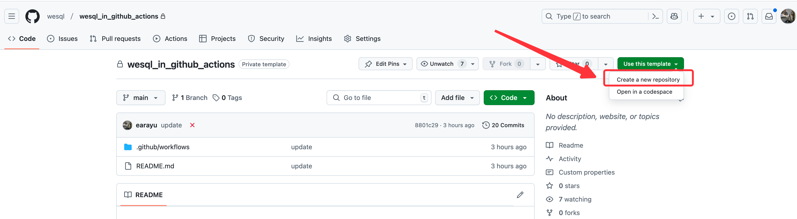
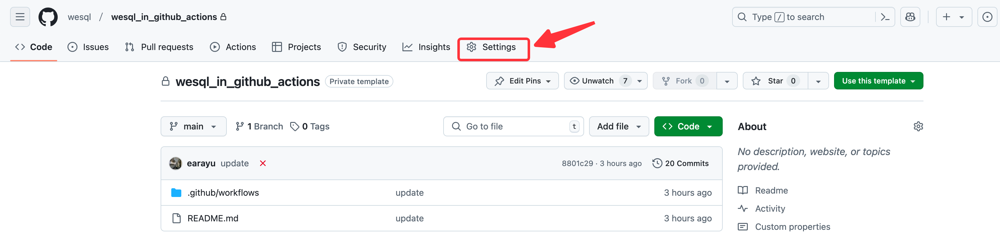
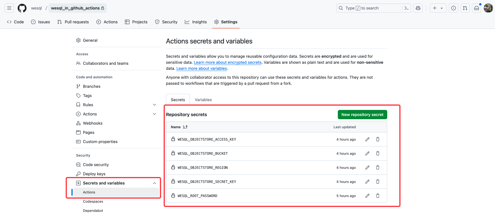
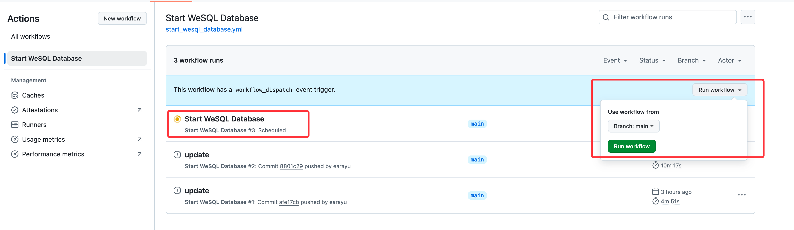
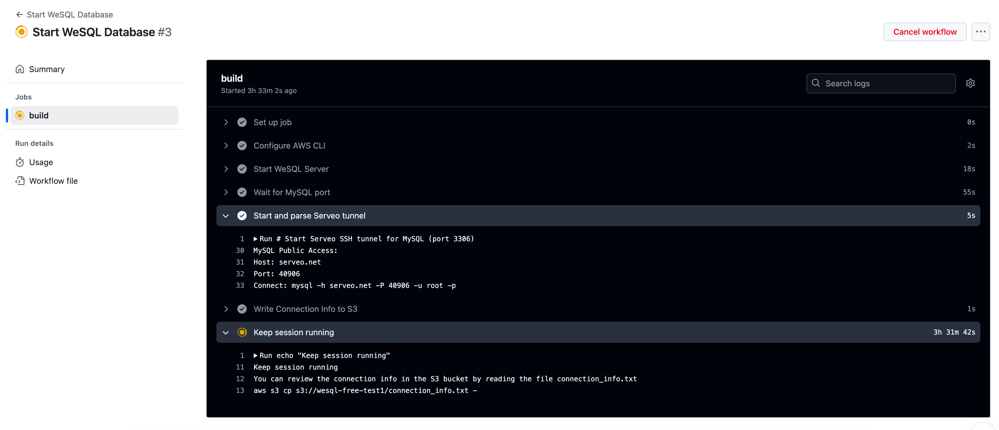
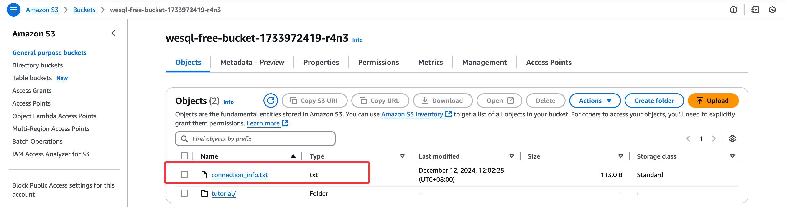

# Run WeSQL Database In Github Actions

## Step 1: Create a new repository using this template


## Step 2: Configure the Secrets needed for the Github Actions
[start_wesql_database.yml](.github%2Fworkflows%2Fstart_wesql_database.yml) needs the following secrets to be configured in the repository settings:
- WESQL_OBJECTSTORE_ACCESS_KEY: Access key of the object store
- WESQL_OBJECTSTORE_SECRET_KEY: Secret key of the object store
- WESQL_OBJECTSTORE_REGION: Region of the object store
- WESQL_OBJECTSTORE_BUCKET: Bucket name of the object store
- WESQL_ROOT_PASSWORD: Root password of the MySQL database




## Step 3: Trigger the Github Actions
The [start_wesql_database.yml](.github%2Fworkflows%2Fstart_wesql_database.yml) might be triggered automatically or you can trigger it manually.
Don't worry about the concurrency, the latest run will cancel the previous run.


## Step 4: Check the Github Actions logs
You can check the logs of the Github Actions to see the progress.


## Step 5: Check the WeSQL Database Connection Info
You can check the connection info of the WeSQL database in the S3 bucket:


You can also use the following AWS CLI command to get the connection info:

```bash
$ aws s3 cp s3://wesql-free-bucket-1733972419-r4n3/connection_info.txt -
host=serveo.net
port=40906
username=root
password=<your-root-password>
mysql_cli=mysql -h serveo.net -P 40906 -u root -p<your-root-password>
```

## Step 6: Connect to the WeSQL Database
```bash
$ mysql -h serveo.net -P 40906 -u root -p<your-root-password>
```

## For Free S3 Bucket
- [ApeCloud S3](https://wesql.io/bucket)
- [Cloudflare R2](https://developers.cloudflare.com/r2/)
